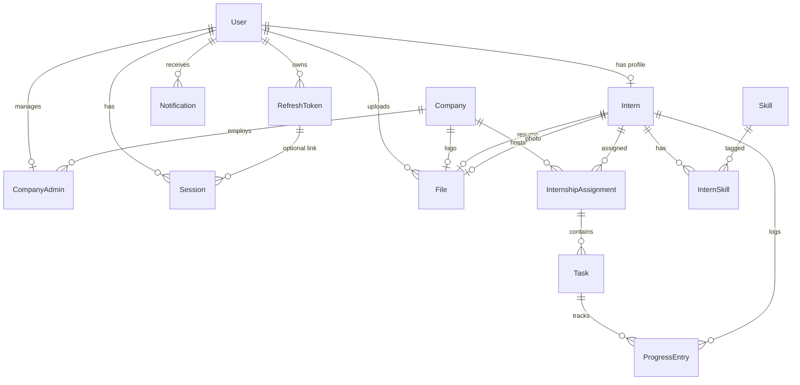

# InternFlow AI — Database Design

Production PostgreSQL schema for an intern management platform. Optimized for **referential integrity**, **query performance**, **soft deletes**, **audit trails**, and a future **microservices** split.

---

## 1. SQL design principles

| Practice | How we apply it |
|----------|-----------------|
| **UUID primary keys** | All tables use `@default(uuid()) @db.Uuid` — safe for distributed IDs and service boundaries. |
| **Timestamptz** | All datetimes use `@db.Timestamptz(6)` (UTC-aware). |
| **Snake_case in DB** | `@map` on columns/tables for PostgreSQL conventions. |
| **Soft delete** | `deleted_at` nullable on core entities; app queries filter `WHERE deleted_at IS NULL`. |
| **Audit columns** | `created_at`, `updated_at`, optional `created_by_id` / `updated_by_id`. |
| **Normalized skills** | `skills` + `intern_skills` junction (no comma-separated skill strings). |
| **File metadata** | `files` table stores paths/URLs; blobs live in object storage (S3, R2, disk). |
| **Token security** | `refresh_tokens.token_hash` stores hashed tokens, not plaintext JWTs. |
| **Denormalized keys** | Assignments carry `company_id` + `intern_id` for partition-friendly queries later. |

### Recommended PostgreSQL extensions

```sql
CREATE EXTENSION IF NOT EXISTS "pgcrypto";   -- gen_random_uuid() (Prisma uuid() uses this)
CREATE EXTENSION IF NOT EXISTS "citext";     -- optional: case-insensitive email
```

### Index strategy

- **Lookup**: `users.email`, `companies.slug`, `skills.slug`
- **Filtering**: `(company_id, status)` on assignments, `(user_id, read_at)` on notifications
- **Soft delete**: `deleted_at` on high-volume tables for partial-index candidates:
  ```sql
  CREATE INDEX idx_interns_active ON interns (user_id) WHERE deleted_at IS NULL;
  ```

---

## 2. Entity-relationship overview



### Relationship summary

| From | To | Cardinality | On delete |
|------|-----|-------------|-----------|
| User | Intern | 1:1 | CASCADE |
| User | CompanyAdmin | 1:1 | CASCADE |
| Company | CompanyAdmin | 1:N | CASCADE |
| Intern | InternSkill | 1:N | CASCADE |
| Skill | InternSkill | 1:N | CASCADE |
| Intern + Company | InternshipAssignment | N:M via assignment row | Intern CASCADE, Company RESTRICT |
| Assignment | Task | 1:N | CASCADE |
| Task / Intern | ProgressEntry | optional / required | SET NULL / CASCADE |
| User | File | 1:N | CASCADE |
| Intern | File (resume/photo) | 1:1 each | SET NULL |

---

## 3. Bounded contexts (microservices-ready)

| Service | Tables | Notes |
|---------|--------|-------|
| **auth-service** | `users`, `refresh_tokens`, `sessions` | JWT + session revocation |
| **company-service** | `companies`, `company_admins` | Org structure |
| **intern-service** | `interns`, `skills`, `intern_skills` | Talent profiles |
| **assignment-service** | `internship_assignments` | Program enrollment |
| **work-service** | `tasks`, `progress_entries` | Execution & tracking |
| **notification-service** | `notifications` | In-app / email fan-out |
| **media-service** | `files` | Upload metadata |

Each table uses UUIDs so services can own IDs without auto-increment collisions.

---

## 4. Table reference

### Users & roles

- **`users`**: Authentication root. `role` ∈ `INTERN | COMPANY_ADMIN | SUPER_ADMIN`.
- **`refresh_tokens`**: Long-lived refresh rotation; store **hash** only.
- **`sessions`**: Device/IP/UA tracking, links optionally to refresh token.

### Organization

- **`companies`**: Legal entity; `logo_file_id` → `files`.
- **`company_admins`**: Links `user_id` + `company_id`; includes `department`, `job_title`.

### Interns

- **`interns`**: College, degree, specialization, GitHub/LinkedIn, duration (`duration_start`/`duration_end`), resume & photo FKs.
- **`skills`** / **`intern_skills`**: Normalized skill catalog with optional proficiency.

### Work

- **`internship_assignments`**: Intern at company for a date range + status workflow.
- **`tasks`**: Scoped to assignment; assignee is a `user_id` (intern’s user).
- **`progress_entries`**: % complete, summary, blockers; tied to intern + optional task.

### Engagement

- **`notifications`**: `metadata` JSONB for extensibility; `read_at` for inbox queries.

### Media

- **`files`**: `kind` enum (RESUME, PROFILE_PHOTO, COMPANY_LOGO, …), `storage_key`, `public_url`.

---

## 5. Role matrix

| Role | Typical access |
|------|----------------|
| **INTERN** | Own profile, assignments, tasks, progress, uploads |
| **COMPANY_ADMIN** | Company scope: interns, assignments, tasks, reports |
| **SUPER_ADMIN** | Platform-wide (all companies), user management |

Enforce in API layer; optional `row_level_security` in PostgreSQL for defense in depth.

---

## 6. Migration & Prisma client setup

### Prerequisites

- PostgreSQL 14+
- `DATABASE_URL` in `backend/.env`

### Commands

```bash
cd backend

# Install dependencies (generates client on postinstall)
npm install

# Create database (psql)
# CREATE DATABASE internflow;

# Apply migrations (production)
npx prisma migrate deploy

# Development: create + apply migration
npx prisma migrate dev --name enterprise_schema

# Regenerate client after schema changes
npx prisma generate

# Open data browser
npx prisma studio
```

### Reset (development only)

```bash
npx prisma migrate reset
```

### Prisma client (application)

```typescript
// src/config/database.ts
import { PrismaClient } from "@prisma/client";

const globalForPrisma = globalThis as { prisma?: PrismaClient };

export const prisma =
  globalForPrisma.prisma ??
  new PrismaClient({
    log: process.env.NODE_ENV === "development" ? ["warn", "error"] : ["error"],
  });

if (process.env.NODE_ENV !== "production") {
  globalForPrisma.prisma = prisma;
}
```

### Soft-delete query pattern

```typescript
// Always exclude soft-deleted rows in services
await prisma.intern.findMany({
  where: { deletedAt: null },
});
```

---

## 7. Migration from previous schema

The earlier MVP schema used `cuid()` IDs and embedded `company_name` on admins. This design:

1. Introduces **`companies`** as a first-class entity.
2. Renames **`intern_profiles`** → **`interns`** with normalized skills.
3. Switches IDs to **UUID**.
4. Moves file URLs into **`files`** with typed `kind`.
5. Adds **sessions**, **tasks**, **progress**, **notifications**.

**Breaking change:** Regenerate migrations on a fresh database or write a custom data migration script before deploying to production.

---

## 8. Sample queries

```sql
-- Active interns at a company
SELECT i.full_name, a.title, a.status
FROM internship_assignments a
JOIN interns i ON i.id = a.intern_id
WHERE a.company_id = $1
  AND a.deleted_at IS NULL
  AND a.status = 'ACTIVE';

-- Unread notifications for a user
SELECT id, title, created_at
FROM notifications
WHERE user_id = $1
  AND read_at IS NULL
  AND deleted_at IS NULL
ORDER BY created_at DESC
LIMIT 20;
```

---

## 9. Future scaling

- **Read replicas** for reporting (`progress_entries`, assignments).
- **Partition** `notifications` by `created_at` (monthly).
- **Outbox table** (not in v1) for event-driven sync between services.
- **S3** `storage_key` in `files`; CDN in front of `public_url`.
